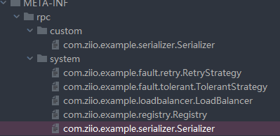
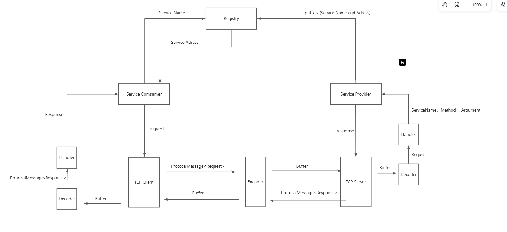

# myRPC

---

### how to work ?

1. 将 rpc - core Module Maven 打包 （install）。

2. 构建一个 rpc - common 包，将要实现的公共接口放入后 install。

3. 同时引入 rpc - core and  rpc - common 即可。

参照 DEMO （example-boot-provider and example-boot-consumer）! 

主要关注 @EnableRpc , @RpcReference , @RpcService

- @EnableRpc 最后依附于你的 Application 入口，做到第一初始化 RpcApplication

- @RpcReference -- Provider 的实现类

- @RpcService -- Consumer 的调用类

---

### What is RPC ?

RPC（Remote Procedure Call）即远程过程调用，是一种计算机通信协议，它允许分布式服务在不同的计算机之间进行通信和交互，就像本地调用一样。

Service Consumer 向 Service Provider 指定服务器发送请求，Provider 服务器截取请求，根据请求参数反射调用本地 Service 类，即可完成调用。

参考框架：[Apache Dubbo](https://cn.dubbo.apache.org/zh-cn/)

---

### Why？

分布式服务调用，除去 RabbitMQ ，kafuka 消息模式的调用，常见的就是 RPC ([Apache Dubbo](https://cn.dubbo.apache.org/zh-cn/)) 和 Restful API ([Spring Cloud OpenFeign](https://spring.io/projects/spring-cloud-openfeign)) 的调用。

RPC 相比 Restful API 调用，省去 Provider 构造不必要的冗余接口。(因为这些接口不一定会被客户端调用，只为了服务端相互调用)  ，还有就是可定制 TCP 协议的灵活性 和 便捷性。

---

### How？

##### Technology Selection

- Vert.x 框架 （Provider 服务器）

- 注册中心 
  
  - Etcd
  
  - ZooKeeper

- 序列化器
  
  - Json -- 可读性
  
  - Kryo -- 二进制数据最小化
  
  - Hessian -- 转换速度

- Guava Retrying 请求重试

- Hutool、Lombok 工具库

- Other
  
  - 负载均衡、重试和容错机制
  
  - Spring Boot Starter 启动服务
  
  - 反射、动态代理和注解驱动

补充：由于使用了 SPI Loader 进行加载，只要遵循 META-INF 文件下的 service 格式，并且遵循相对路径下的接口规则，即可自定义服务类。

##### 流程图：

